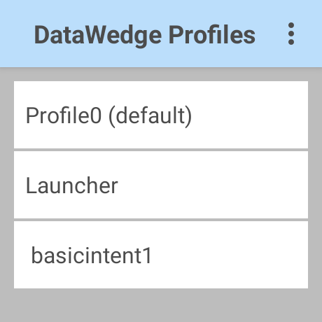
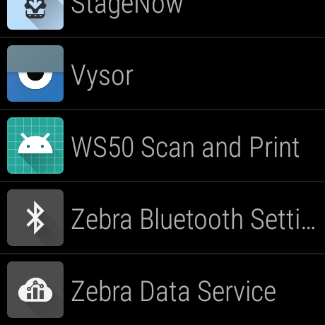
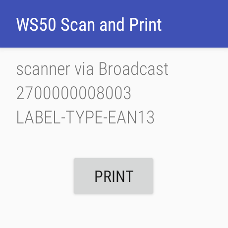

WS50 シリーズのデモで利用可能なデモアプリのソースコードとそのガイド。


#### デモ必要なマテリアル

| マテリアル | システム要件 |
|-|-|
| Zebra Link-OS プリンタ | 要Bluetooth Classic。<br>Link-OS 5.2以上。<br>RFID プリンタが望ましい。
| ラベル    | 75 x 75 mmラベル。<br>別サイズのラベルを利用の際はsample01.prnを更改すること。
| WS50 or WS50R         | Android 11

<br>
※ 設定のためにWindows PCや接続ケーブル類は別途必要です。

<br>

### 設定ガイド

1. プリンタから印刷が可能な状態（基本設定等）にしておく。

1. プリンタにsample01.prnを送付します。
    正常に送付できている場合はラベルが１枚印刷されます。

1. WS50にdwprofile_ basicintent1.dbをコピーする。

    <br>

    |||
    |-|-|
    |コピーするファイル | dwprofile_ basicintent1.db
    |コピー先のフォルダ | WS50:/enterprise/device/settings/datawedge/autoimport 

    <br>

    ##### コピー方法の例
    ```batch
    C:TEST>dir
    Volume in drive C is OSDisk
    Volume Serial Number is 2C6D-4538

    Directory of C:TEST

    2024/08/19  18:39    <DIR>          .
    2024/08/19  18:39    <DIR>          ..
    2024/08/19  18:28           397,312 dwprofile_ basicintent1.db
                1 File(s)        397,312 bytes
                2 Dir(s)  192,608,206,848 bytes free

    C:TEST>adb push "dwprofile_ basicintent1.db" /enterprise/device/settings/datawedge/autoimport
    dwprofile_ basicintent1.db: 1 file pushed, 0 skipped. 25.0 MB/s (397312 bytes in 0.015s)
    ```

<br>

1. WS50: DataWedge Profileにbasicintent1があることを確認する。

    

<br>

1. Android Studioを用いて、ソースコードを開きます。

1. 下記部分を接続先プリンタのBluetooth MACアドレスに変更します。


    #### MainActivity.java
    
    ```java
    public void onClick(View view) {
        logv("btn clicked");
        String theBtMacAddress = "AC:3F:A4:B8:B2:33"; ★ここを変える
    ```

<br>

1. AndroidプログラムをBuildし、WS50へインストールする。


### デモアプリ解説

1. アプリの起動
    "WS50 Scan & Print"を選択

    

    <br>

1. スキャン
    トリガーボタンを押下して、スキャンします。

    |スキャン内容|説明|
    |-|-|
    | １行目 | データ取得経由 
    | ２行目 | バーコードのスキャン結果
    | ３行目 | バーコードタイプ

    <br>


    ##### JAN13を読んだ結果例

    

    <br>

1. 印刷

    Printボタンを選択することでBluetooth経由で印刷とエンコードができます。


<br>


#### 参考：ZPL:Sample01.prnの構成

印刷内容やラベルサイズに応じて、sampole01.prnの内容を変更すること。

```zpl
^XA
^DFE:sample01.prn^FS
~TA000
~JSN
^LT0
^MNM,0
^MTT
^PON
^PMN
^LH0,0
^JMA
^PR8,8
~SD15
^JUS
^LRN
^CI27
^PA0,1,1,0
^RS8,,,3
^MMT
^PW609
^LL609
^LS0
^FT58,88^A0N,25,25^FH\^CI28^FDScan Data^FS^CI27
^FT58,231^A0N,25,25^FH\^CI28^FDRFID Encode Data^FS^CI27
^BY2,3,74^FT58,178^BCN,,Y,N,,A
^FN1"bar"^FS
^BY2,3,75^FT58,322^BCN,,Y,N,,A
^FN2"epc"^FS
^RFW,H,1,2,1^FD3000^FS
^RFW,H,2,12,1^FN2"epc"^FS
^XZ


^XA
^XFE:sample01.prn^FS
^CI27^FN1^FH\^FD123456789012^FS
^CI27^FN2^FH\^FD123456789012345678901234^FS
^PQ1,0,1
^XZ
```
